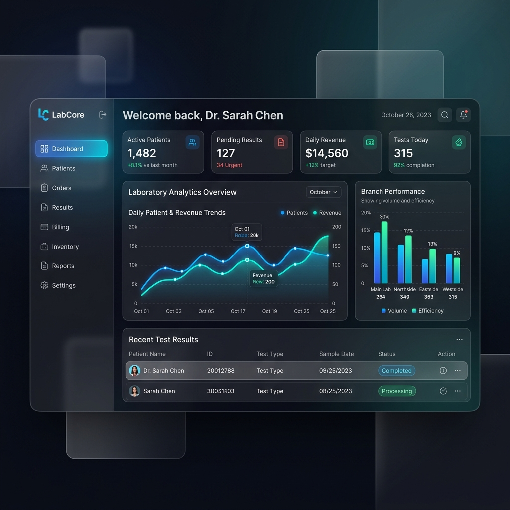
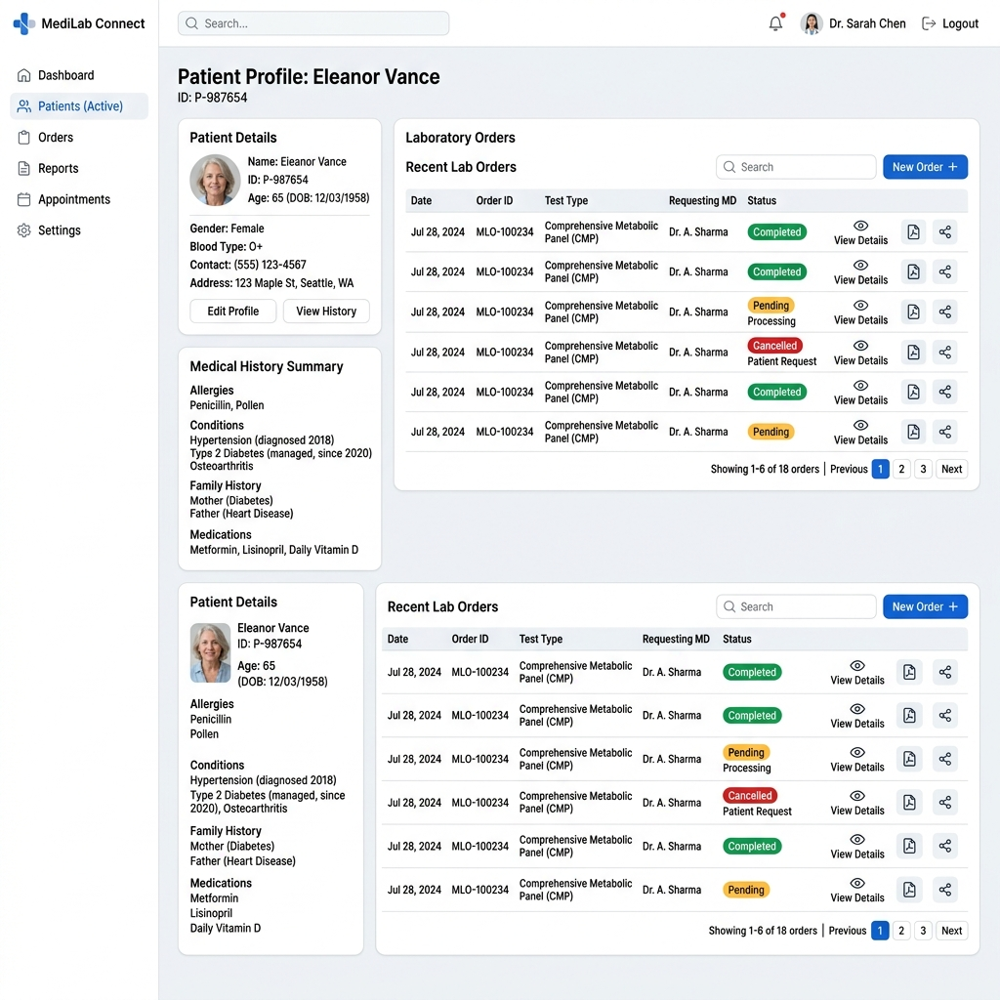
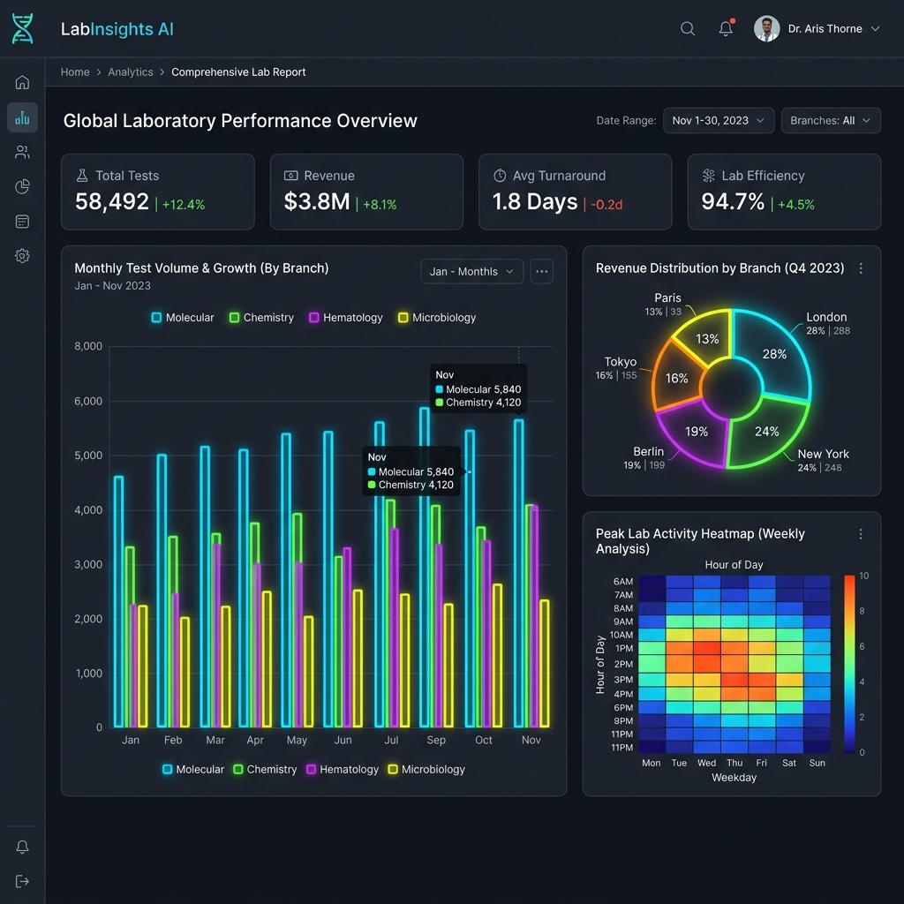
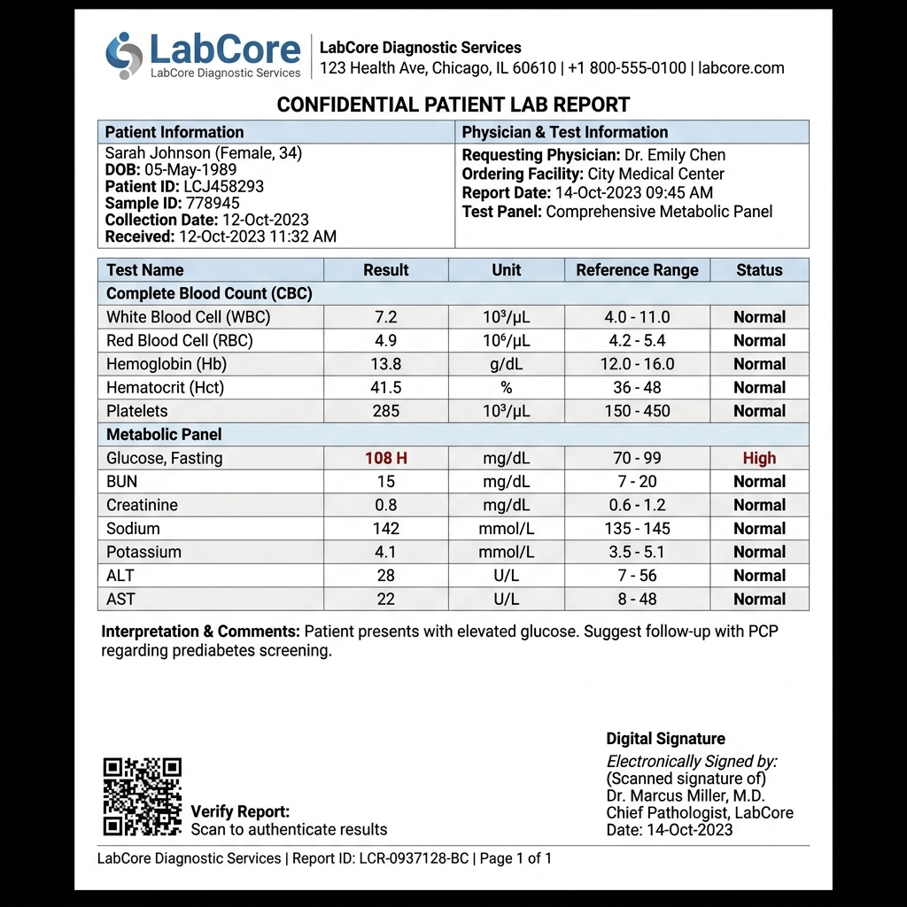
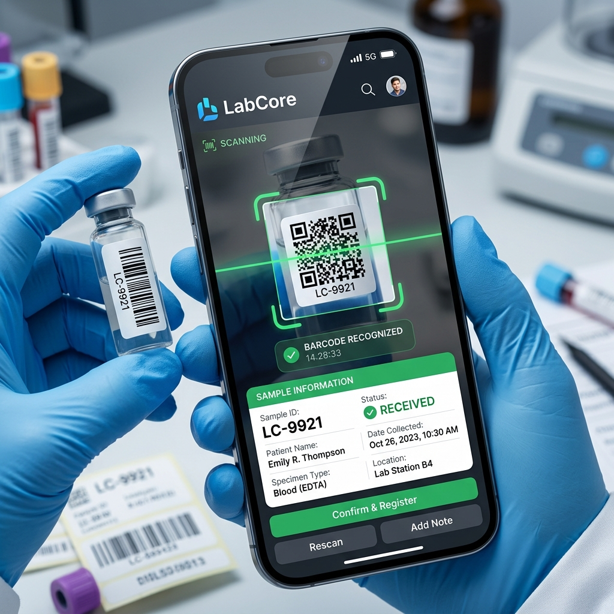
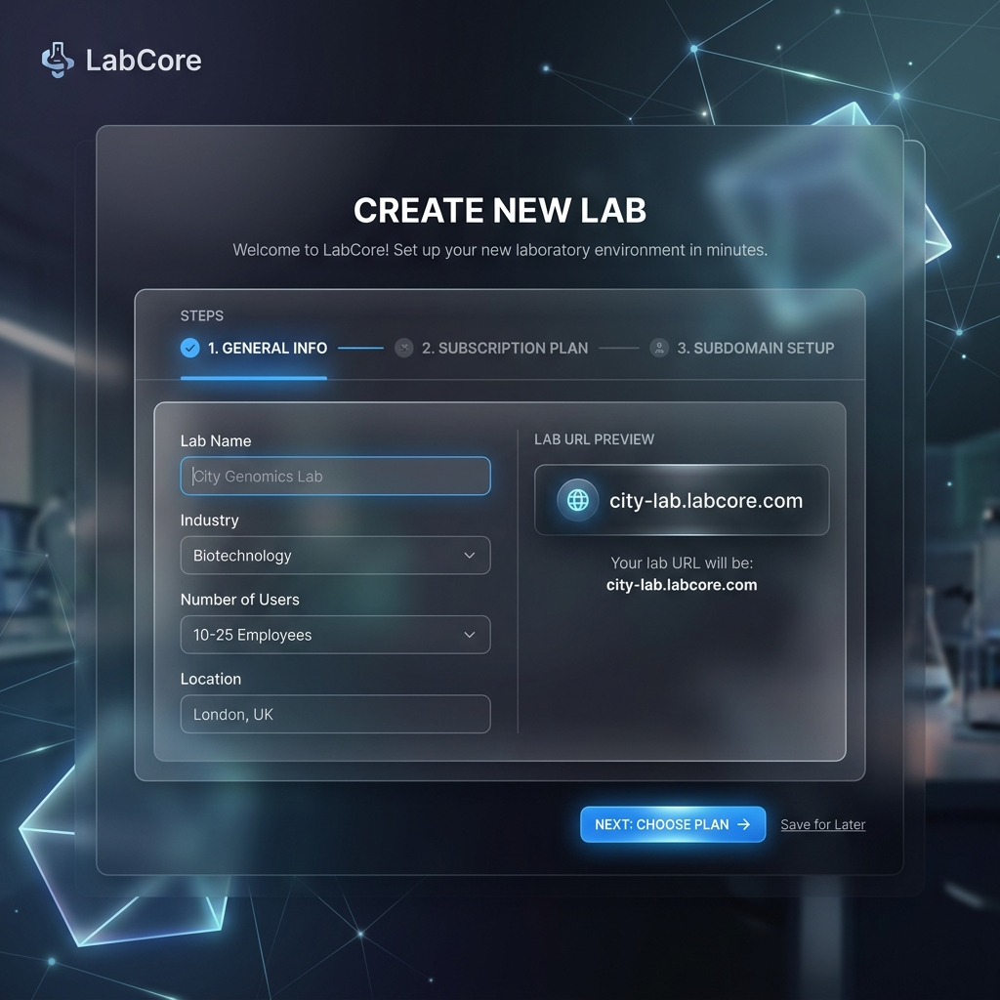
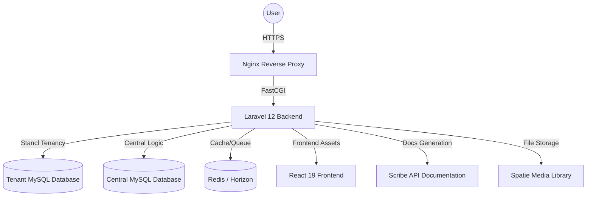

# LabCore 🧪

A scalable multi-tenant Medical Laboratory SaaS built using Laravel 13 and React 19.


LabCore helps laboratories and diagnostic centers manage patients, lab orders, test results, billing, sample tracking, and branch operations through a modern cloud-based platform.

---

# 📸 Screenshots & Demos

### 📊 Dashboard


### 👤 Patient Profile


### 📈 Advanced Analytics


### 📄 Medical Reports (PDF)


### 🔍 Feature Highlights
| Barcode Scanning | Tenant Creation |
| :---: | :---: |
|  |  |

---

# 🚀 Features

## Core Features
- **Multi-Tenant Architecture**: Complete isolation of data using Stancl Tenancy.
- **Authentication & RBAC**: Secure access control with Spatie Permission.
- **Patient Management**: Comprehensive medical history and visit tracking.
- **Lab Orders Workflow**: End-to-end management from order to result.
- **Results Management**: Clinical validation and approval workflows.
- **PDF Report Generation**: Professional reports with QR verification.

## Enterprise Features
- **Sample Tracking**: Full lifecycle tracking with barcode integration.
- **Activity Timeline**: Audit logs for every action in the system.
- **Analytics Dashboard**: Real-time insights and performance metrics.
- **Redis + Horizon**: High-performance queue management.

---

# 🏗️ Architecture



---

# 📦 API Documentation

The API documentation is powered by **Scribe (Swagger/OpenAPI)**.

To generate or update the documentation:
```bash
php artisan scribe:generate
```
Once generated, you can access the documentation at `/docs` (or as configured in `config/scribe.php`).

---

# 📈 Future Plans
- [ ] **AI-powered insights**: Predictive analytics for patient health trends.
- [ ] **Mobile Applications**: Dedicated iOS/Android apps for field workers.
- [ ] **HL7 Integration**: Standardized health information exchange.
- [ ] **Insurance Integration**: Automated claims and billing.
- [ ] **E-Invoice Egypt**: Compliance with Egyptian tax authorities.

---

# 👨‍💻 Author
**Mohamed Taha**
*Backend Developer specialized in Laravel & SaaS Architecture.*

---

# 📄 License
This project is licensed under the **MIT License**.

---

# ⚙️ Installation

## Clone Repository
```bash
git clone https://github.com/MohammedTaha187/LabCore.git
cd LabCore
```

## Backend Setup
```bash
composer install
cp .env.example .env
php artisan key:generate
php artisan migrate --seed
```

## Frontend Setup
```bash
npm install
npm run dev
```